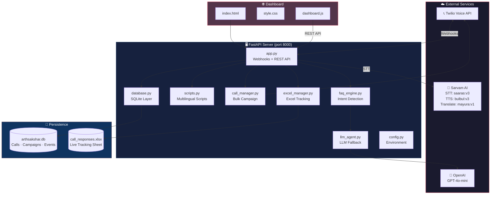
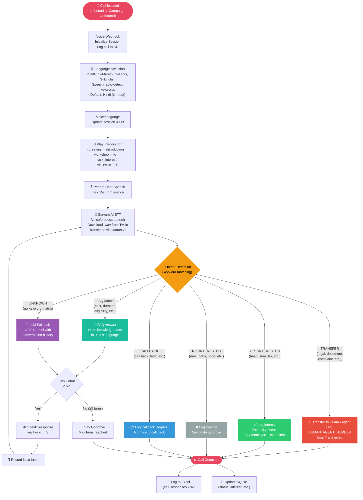
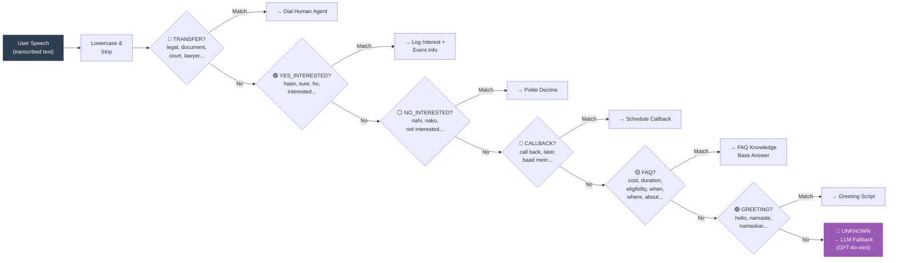
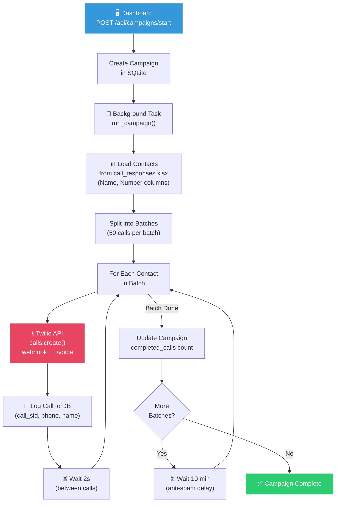
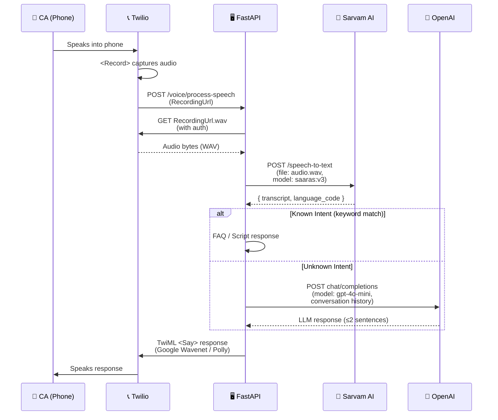
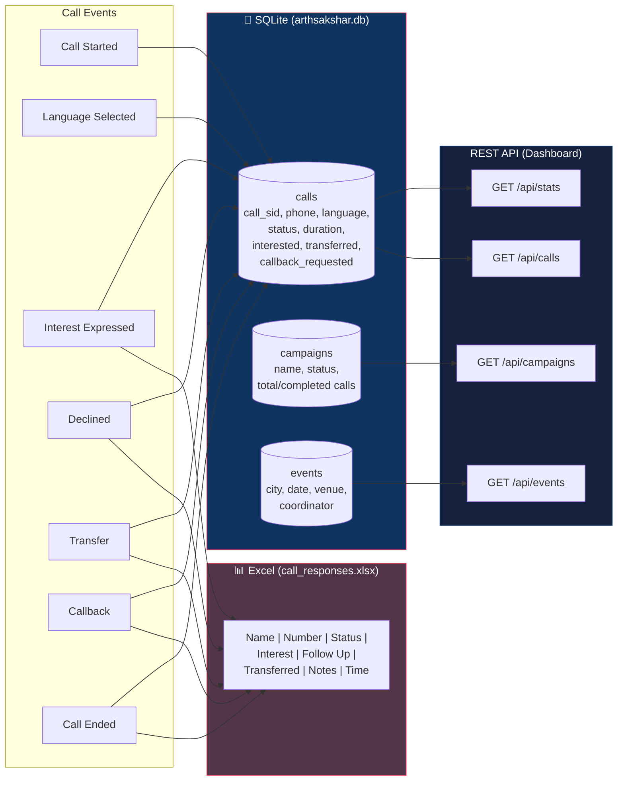
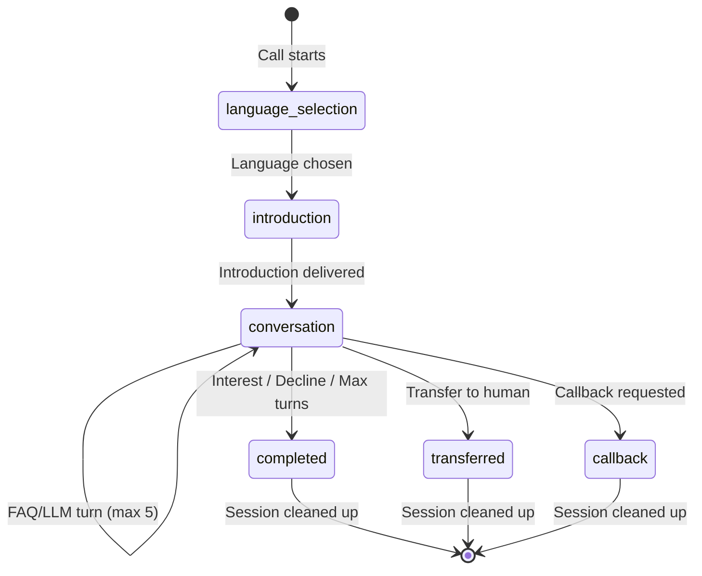
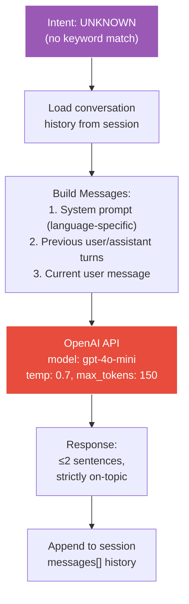

# 🇮🇳 ArthSakshar AI — Project Workflow Analysis

## Project Overview

**ArthSakshar AI** is an AI-powered, multilingual voice outreach system for **Maharashtra's Budget Literacy Initiative**. It automatically calls **65,000+ Chartered Accountants**, explains budget workshops in **Marathi/Hindi/English**, answers FAQs using keyword-based intent detection, escalates complex queries to an **LLM (GPT-4o-mini)**, and transfers unresolvable questions to a **human agent**.

| Aspect | Details |
|---|---|
| **Backend** | FastAPI (Python), Uvicorn |
| **Voice Calling** | Twilio Voice API (outbound + inbound) |
| **Speech-to-Text** | Sarvam AI `saaras:v3` |
| **Text-to-Speech** | Twilio built-in (Google Wavenet / Polly) |
| **LLM Fallback** | OpenAI GPT-4o-mini |
| **FAQ Engine** | Keyword-based intent detection (Marathi/Hindi/English) |
| **Database** | SQLite (aiosqlite, WAL mode) |
| **Tracking** | Excel (openpyxl, call_responses.xlsx) |
| **Dashboard** | Vanilla HTML/CSS/JS (premium dark theme) |
| **Languages** | Marathi, Hindi, English |

---

## 1. System Architecture (High-Level)



---

## 2. End-to-End Call Flow (Main Workflow)

This is the **core workflow** of the entire system — from call initiation to completion.



---

## 3. Intent Detection & Routing Pipeline

The FAQ engine uses a **priority-ordered keyword matching** system. Higher-priority intents (like `TRANSFER`) are checked first for safety.



### Intent Priority Order (Highest → Lowest)

| Priority | Intent | Action | Keywords (Sample) |
|:---:|---|---|---|
| 1 | `TRANSFER` | Dial human agent | legal, document, court, lawyer, कानूनी, कायदेशीर |
| 2 | `YES_INTERESTED` | Log interest, share events | yes, haan, ho, sure, हाँ, होय |
| 3 | `NO_INTERESTED` | Log decline, goodbye | no, nahi, nako, नहीं, नाही |
| 4 | `CALLBACK` | Log callback request | call back, later, बाद में, नंतर |
| 5 | `COST` | FAQ: free program | cost, fee, price, शुल्क, किंमत |
| 6 | `DURATION` | FAQ: 2-3 hours | duration, how long, किती वेळ |
| 7 | `ELIGIBILITY` | FAQ: who can attend | eligible, who can, पात्रता, कोण |
| 8 | `SCHEDULE` | FAQ: date/timing | when, date, कब, केव्हा |
| 9 | `LOCATION` | FAQ: venue/place | where, venue, कहाँ, कुठे |
| 10 | `PROGRAM_DETAILS` | FAQ: about the program | details, information, माहिती, जानकारी |
| 11 | `GREETING` | Greeting response | hello, namaste, नमस्कार |
| 12 | `UNKNOWN` | **LLM Fallback** (GPT-4o-mini) | *(no match)* |

---

## 4. Campaign / Bulk Calling Pipeline



> [!IMPORTANT]
> **Rate Limiting**: Batches of 50 calls with 10-minute delays between batches and 2-second delays between individual calls to avoid telecom spam flags.

---

## 5. Speech Processing Pipeline (Sarvam AI)



---

## 6. Data Persistence & Dual Logging

The system maintains **two parallel persistence layers** — SQLite for structured querying and Excel for real-time operational tracking.



> [!NOTE]
> Excel writes are protected by an `asyncio.Lock` to prevent concurrent write corruption. The Excel file serves dual duty — it's both the **contact source** for campaigns and the **live tracking destination** for call outcomes.

---

## 7. Session Management (In-Memory)

Each active call maintains an in-memory session (`call_sessions` dict) keyed by Twilio's `CallSid`:



**Session Data Structure:**
```json
{
  "language": "marathi | hindi | english",
  "state": "language_selection | introduction | conversation",
  "turn_count": 0,
  "interested": false,
  "messages": [
    {"role": "user", "content": "..."},
    {"role": "assistant", "content": "..."}
  ]
}
```

---

## 8. LLM Fallback Pathway

When the FAQ engine returns `UNKNOWN`, the system escalates to GPT-4o-mini with **full conversation history** for contextual responses:



> [!TIP]
> The LLM is constrained by language-specific system prompts that enforce: (1) max 2 sentences, (2) budget-literacy topics only, (3) suggest human callback for complex questions.

---

## 9. File-by-File Module Summary

| File | Role | Key Functions |
|---|---|---|
| [app.py](file:///d:/Projects/arthsakshar-ai/app.py) | Main FastAPI server | Webhooks (`/voice`, `/voice/language`, `/voice/process-speech`, `/voice/conversation`, `/voice/status`), REST API, TTS voice config |
| [config.py](file:///d:/Projects/arthsakshar-ai/config.py) | Centralized config | Loads `.env` vars (Sarvam, Twilio, OpenAI, DB, rate limits) |
| [faq_engine.py](file:///d:/Projects/arthsakshar-ai/faq_engine.py) | Intent detection + FAQ KB | `detect_intent()`, `process_user_input()`, multilingual knowledge base |
| [llm_agent.py](file:///d:/Projects/arthsakshar-ai/llm_agent.py) | LLM fallback | `generate_response()` via GPT-4o-mini with conversation history |
| [sarvam_ai.py](file:///d:/Projects/arthsakshar-ai/sarvam_ai.py) | Sarvam AI client | STT (`saaras:v3`), TTS (`bulbul:v3`), Translation (`mayura:v1`) |
| [scripts.py](file:///d:/Projects/arthsakshar-ai/scripts.py) | Multilingual scripts | Greeting, intro, FAQ, fallback in Marathi/Hindi/English |
| [call_manager.py](file:///d:/Projects/arthsakshar-ai/call_manager.py) | Bulk calling | `run_campaign()` with batch processing & rate limiting |
| [database.py](file:///d:/Projects/arthsakshar-ai/database.py) | SQLite layer | CRUD for calls, campaigns, events; dashboard stats |
| [excel_manager.py](file:///d:/Projects/arthsakshar-ai/excel_manager.py) | Excel tracking | `log_call_response()` with phone-number dedup |
| [dashboard.py](file:///d:/Projects/arthsakshar-ai/dashboard.py) | Dashboard helpers | Additional dashboard utilities |

---

## 10. Key Architectural Decisions

| Decision | Rationale |
|---|---|
| **Twilio TTS** (not Sarvam TTS) for call responses | Eliminates HTTP round-trip latency; Twilio plays directly without downloading audio |
| **Sarvam AI STT** (not Twilio STT) for transcription | Superior Indic language support (Marathi, Hindi) with `saaras:v3` model |
| **Keyword-based intent** before LLM | Faster, cheaper, deterministic for common intents; LLM only for edge cases |
| **In-memory sessions** (dict) | Low-latency for active calls; acceptable since calls are ephemeral (max 5 turns) |
| **Dual persistence** (SQLite + Excel) | SQLite for dashboards/analytics; Excel for operational teams to monitor live |
| **Record-then-transcribe** pattern | More reliable than streaming STT for telephony; Twilio `<Record>` handles audio capture |
| **Max 5 conversation turns** | Keeps calls focused and cost-effective; prevents runaway API costs |
